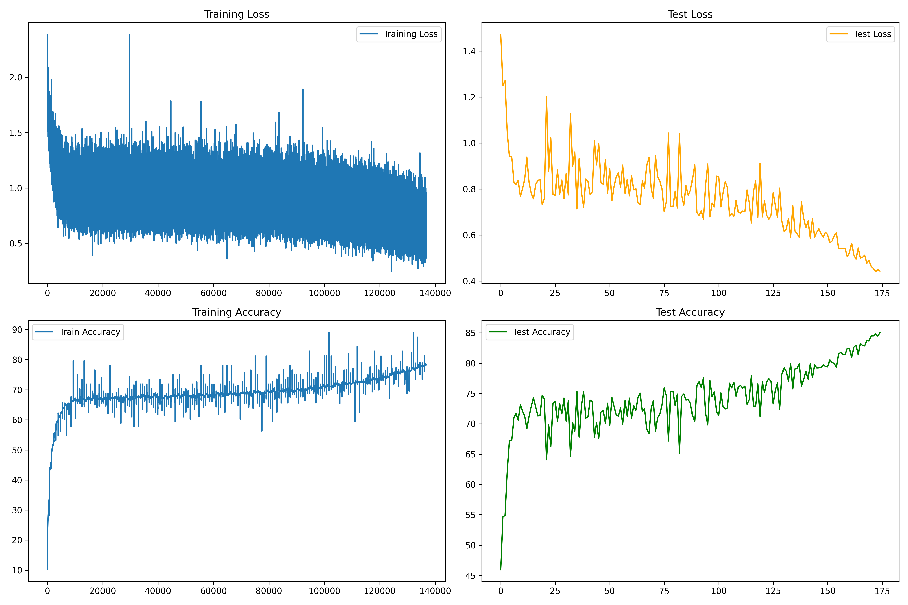

# CIFAR-10 Image Classification with Advanced CNN Architecture

## Overview

This project implements a sophisticated Convolutional Neural Network (CNN) for CIFAR-10 image classification, achieving **85.07% test accuracy** in 175 epochs. The architecture incorporates modern deep learning techniques including depthwise separable convolutions, dilated convolutions, and strategic data augmentation without using max pooling layers.

## Project Structure

```text
├── ModelCIFAR10.py              # CNN architecture definition
├── ExperimentCIFAR10.py         # Training and evaluation pipeline
├── cifar10_best_model.pth       # Best trained model (85.07% accuracy)
├── requirements.txt             # Project dependencies
├── RF-Calculations-A7.xlsx      # Receptive field calculations
├── training_results-*.png       # Training visualization plots
└── training_results-*.log       # Detailed training logs
```

## Model Architecture

### Network Design

The CNN architecture is designed with **four main convolutional blocks** (C1-C4) followed by Global Average Pooling and a fully connected layer. The model achieves a final **receptive field of 77x77** pixels, which is significantly larger than the input image size of 32x32, ensuring comprehensive feature extraction.

### Key Architectural Components

#### 1. **Depthwise Separable Convolutions**

- Implemented in Block C2 to reduce computational complexity while maintaining feature learning capability
- Separates spatial and channel-wise convolutions, reducing parameters by ~8x compared to standard convolutions
- Enables efficient feature extraction with lower memory footprint

#### 2. **Dilated Convolutions**

- Applied in Block C3 with dilation=2 as a "receptive field booster"
- Expands the receptive field without increasing parameters or losing spatial resolution
- Critical for capturing larger contextual information in small CIFAR-10 images

#### 3. **No Max Pooling Strategy**

- Replaced traditional max pooling with strided convolutions for downsampling
- Preserves more spatial information during feature extraction
- Maintains learnable parameters in the downsampling process

#### 4. **1x1 Convolutions**

- Used after each block for channel reduction and feature consolidation
- Acts as learnable linear combinations of feature maps
- Reduces computational burden while maintaining representational power

### Receptive Field Analysis

Based on the detailed calculations in [`RF-Calculations-A7.xlsx`](RF-Calculations-A7.xlsx):

| Layer Block | Input Size | Output Size | Receptive Field |
|-------------|------------|-------------|-----------------|
| C1 (Normal Conv) | 32x32 | 16x16 | 5x5 |
| C2 (Depthwise Sep) | 16x16 | 8x8 | 13x13 |
| C3 (Dilated Conv) | 8x8 | 8x8 | 37x37 |
| C4 (Normal Conv) | 8x8 | 4x4 | 53x53 |
| GAP + FC | 4x4 | 1x1 | 77x77 |

The progressive receptive field growth ensures the model can capture both local patterns and global context effectively.

## Data Augmentation Strategy

The training pipeline uses **Albumentations** library for advanced data augmentation:

- **Horizontal Flip (p=0.5)**: Improves model generalization to mirrored objects
- **Affine Transformations**: Translation (±5%), scaling (0.9-1.1x), rotation (±10°) for geometric robustness
- **CoarseDropout**: 16x16 pixel cutout with CIFAR-10 mean fill to prevent overfitting and improve occlusion handling
- **Normalization**: Channel-wise normalization using CIFAR-10 dataset statistics

## Training Configuration

### Optimizer and Learning Rate Schedule

- **SGD Optimizer**: Learning rate 0.05, momentum 0.9, weight decay 5e-4
- **OneCycleLR Scheduler**:
  - Max LR: 0.1 with cosine annealing
  - Warm-up phase: 20% of training (pct_start=0.2)
  - LR range: 0.005 → 0.1 → 0.001 for optimal convergence

### Training Parameters

- **Batch Size**: 64 (training), 1000 (testing)
- **Target Accuracy**: 85.0%
- **Maximum Epochs**: 200
- **Early Stopping**: Achieved target at epoch 175

## Results and Performance Analysis

### Training Progression



The model demonstrated excellent learning characteristics:

- **Initial Performance**: Started at 45.93% accuracy in epoch 1
- **Steady Improvement**: Consistent accuracy gains with minimal overfitting
- **Convergence**: Reached 85.07% test accuracy at epoch 175
- **Stability**: Final epochs showed stable performance around target accuracy

### Key Performance Metrics

| Metric | Value |
|--------|-------|
| **Final Test Accuracy** | 85.07% |
| **Training Epochs** | 175 |
| **Best Model Parameters** | 164,138 |
| **Model Size** | 3.34 MB |

### Learning Insights

1. **Gradual Learning**: The model showed steady improvement without aggressive overfitting, indicating well-balanced regularization
2. **Effective Architecture**: The combination of different convolution types provided complementary feature learning capabilities
3. **Optimal Scheduling**: OneCycleLR enabled efficient convergence within the target epoch range
4. **Data Augmentation Impact**: Robust augmentation strategy contributed to good generalization performance

## Technical Specifications

### Model Summary

```text
Total Parameters: 164,138
Trainable Parameters: 164,138
Model Size: 3.34 MB
Input Shape: (3, 32, 32)
Output Classes: 10
```

### Dependencies

- PyTorch 2.3.0 (CUDA 12.1)
- Albumentations (data augmentation)
- TorchVision (dataset handling)
- TorchSummary (model analysis)

## Key Learnings

1. **Architectural Diversity**: Combining different convolution types (standard, depthwise separable, dilated) creates a more robust feature extraction pipeline
2. **Receptive Field Management**: Strategic receptive field growth is crucial for small image classification tasks
3. **Efficient Training**: Modern learning rate schedules and data augmentation significantly impact convergence speed and final performance
4. **Parameter Efficiency**: Achieved competitive accuracy with a compact model through careful architectural choices

## Usage

```bash
# Install dependencies
pip install -r requirements.txt

# Train the model
python ExperimentCIFAR10.py

# Model will automatically save the best checkpoint as cifar10_best_model.pth
```

---

*This implementation demonstrates the effectiveness of modern CNN techniques for efficient image classification on the CIFAR-10 dataset.*
